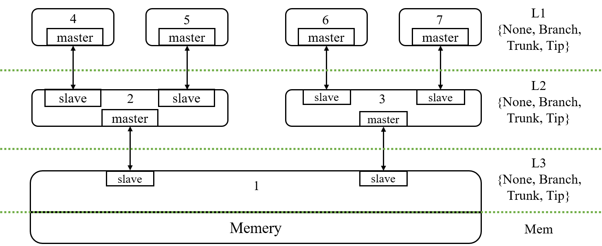
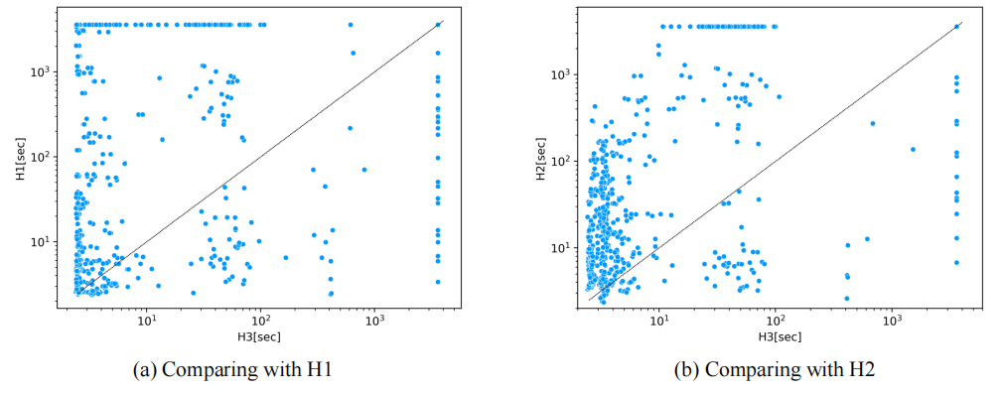
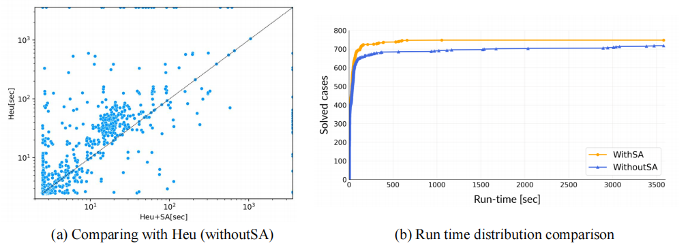

# An Enhanced Directed Model Checking algorithm based in Murphi


## Overview

MurphiEDMC is an explicit model checker designed to alleviate the state space explosion. Our development work is based on Murphi, which is a popular protocol verification tool. 
MurphiEDMC is more likely to work well on very complex protocol models at the same cost(e.g., time, memory). In this site, we use it to conduct reachability analysis experiments on Tilelink Cached(TL-C) protocol models.  


## Requirement & Start

Before starting the installation, please first check if your environment meets the following requirement: 
1. Operating systems: Linux or MacOS
2. g++ 9.4.0 
3. Python 3.8.10

Then let's install the dependencies:
```
  sudo apt-get install flex bison
  sudo make install 
```

Now, we can compile the source code of MurphiEDMC: 
```  
  # in folder MurphiEDMC
  cd src/  
  make clean
  make
```

Since MurphiEDMC invokes Z3 when parsing the protocol model, we need to install Z3: 
```
  git clone https://github.com/Z3Prover/z3.git
  python scripts/mk_make.py
  cd build
  make
  sudo make install
  make examples
```

## How to run MurphiEDMC

1. Run MurphiEDMC to verify <testcase_name>.m by using automation script:  
```
  bash run.sh <testcase_name>
```

2. Or if you want to set options with MurphiEDMC as you wish(e.g., -localsearch/-vbfs/vdfs), you can run the following three commands:

  1. Parser Murphi file to Cpp file: 
  ```
    ../src/mu <testcase_name>.m 
  ```

  2. Compiler Cpp file to execute file(.o): 
  ```
    g++ -ggdb -o <testcase_name>.o <testcase_name>.cpp -I ../include -lm  
  ```

  3. Run execute file with 5000MB memory limitation and the selected algorithm
  ```
    ./<testcase_name>.o -localsearch -m 5000 
  ```

You can change options to what you want when running execute file. 
Run "./<testcase_name>.o -h" to show what options are supported in MurphiEDMC. 

## Files organization

```
MurphiEDMC
│   README.md
└─── MurphiEDMC
│   │   
│   └─── include
│   │  
│   └─── src
│   │   
│   └─── ...
│ 
└─── Benchmarks
│   │   
│   └─── models
│   │  
│   └─── states
│   
└─── ExperimentLogs
    │   
    └─── Experiment1
    │  
    └─── Experiment2
```


### MurphiEDMC

This directory contains the source code (**src**), the algorithm library (**include**), and simple test cases (**test**) for MurphiEDMC. When verifying specific protocols, **src/mu** compiles <protocol>.m into <protocol>.cpp, and then g++ <protocol>.o <protocol>.cpp -I **../include** is invoked. 

### Benchmarks

This folder contains the Murphi and NuSMV modeling files for the TileLink Cache(TL-C) protocols used in our experiments, as well as all target states (cache coherence trees) used in our reachability analysis experiment. 

#### models

The directory **models** holds our Murphi and NuSMV models for TL-C protocols. The filename indicates the feature of a model. For example, **TL-C_NonIn_M_data** models the noninclusive(NonIn) TL-C model with multiple addresses(M) and data(data). 

#### states

The directory **states** contains a program that can generate all possible coherence trees by runing **main.py**. All of them are saved in the files **states_Inclusive_visualization.txt** and **states_NonInclusive_visualization.txt**, which record the possible coherence trees under the inclusive and non-inclusive modes respectively. 

### ExperimentLogs

This folder contains all log files of our experiments, which record corresponding information of each search process, including the number of explored states, running time, and memory consumption. 
Specifially, **Experiment1** corresponds to the comparative experiments of all typical algorithms(BFS, DFS, NuSMV, DMC, EDMC), **Experiment2.1** corresponds to the comparative experiments of heuristic function effectiveness, and **Experiment2.2** corresponds to the comparative experiments of SA strategy effectiveness. 


## Target States

### TL-C protocol models

TL-C(Tilelink Cached) is a standard interface for on-chip communication in modern computer systems. It provides a scalable, low-latency and coherent way of exchanging data between different components of a System-on-Chip (SoC) design, such as processors, accelerators, and memory controllers. They enable the creation of homogeneous and heterogeneous many-core systems by providing a simple and uniform way of accessing memory and I/O resources. 

Essentially, TL-C is a widely used hierarchy cache protocol in RISC-V systems. Its basic framework is shown below.



According to the specification of TileLink, we generate all coherence trees and check their reachability. The ability to search for the target state is also an important part of bug hunting, which is one of the most valuable features of model checking tools. 


### Coherence Trees


 
The figure above, representing a reachable coherence tree, is the 2nd case of **Benchmarks/states/states_Inclusive_visualization.txt**:
```
2
TLState.INVALID
├── TLState.INVALID
│   ├── TLState.INVALID
│   └── TLState.INVALID
└── TLState.INVALID
    ├── TLState.INVALID
    └── TLState.BRANCH
```

### Generating All Possible Coherence Trees

In **Benchmarks/states**, we provide the Python scripts to generate all possible coherence trees of TL-C models. The program **generate.py** can generate the protocol automatically according to the parameters entered by user. There are 4 parameters that determine the structure of coherence tree, inclusion policies and data control:

- d(depth): Determine the height of the tree(default: 2);
- b(branch): Determine the number of children for each node(default: 2);
- i(inclusion): Decide whether to adopt the inclusive or non-inclusive policy(default: inclusive);
- c(data control): Decide whether to add data and related controls(default: False).

For example, we can run **generate.py** with

```
python generate.py -d 3 -b 2 -i inclusive -c true
```

to obtain a protocol with 3-level cache coherence tree. 


### Invariants
To analyse the reachability of it in the Murphi, we negate the logical conjunction of the cache states of all tree nodes, taking the result as the corresponding invariant, as shown below. This example is the 2nd case of **Benchmarks/states/states_Inclusive_visualization.txt**. 
```
invariant "test_reachable_state_2"
    !( Tree[1].cache.state = None & Tree[2].cache.state = None & Tree[4].cache.state = None & Tree[5].cache.state = None & Tree[3].cache.state = None & Tree[6].cache.state = None & Tree[7].cache.state = Branch );
```
In the next step it's put in the **Benchmarks/models/Murphi/<TL-C_model>.m** and checked by Murphi. When this invariant is violated, it indicates that the corresponding cache coherence tree is reachable for the current protocol model. All invariants of NonInclusive TL-C, including this one, are stored in the file **Benchmarks/states/states_NonInclusive_visualization.txt**. Notice that the structure of coherence tree has nothing to do with data, so TL-C_NonIn and TL-C_NonIn_Data have the same invariants.


## Experiments

This section provides a overall of our experiments. The corresponding figures and original log files, and statistical tables are presented. 

### Experiment1

All results of reachability analysis are shown below, clicking on the link will jump to the statistical table for the corresponding model. 

|       Protocol         | #Coherence Trees  | BFS | DFS | A*  | EDMC |    result file link    |
|:----------------------:|:-----------------:|:---:|:---:|:---:|:----:|:----------------------:|
| TL-C\_S\_In\_NoData    |        38         |  38 |  38 |  38 |  38  | [statistical_table1](./ExperimentLogs/Experiment1/SingleAddr_Inclusive_Nodata/result.md) |
| TL-C\_S\_In\_Data      |        38         |  38 |  38 |  38 |  38  | [statistical_table2](./ExperimentLogs/Experiment1/SingleAddr_Inclusive_Data/result.md) |
| TL-C\_S\_NonIn\_NoData |       224         | 224 | 220 | 224 | 224  | [statistical_table3](./ExperimentLogs/Experiment1/SingleAddr_NonInclusive_Nodata/result.md) |
| TL-C\_S\_NonIn\_Data   |       224         | 223 | 202 | 224 | 224  | [statistical_table4](./ExperimentLogs/Experiment1/SingleAddr_NonInclusive_Data/result.md) |
| TL-C\_M\_In\_Data      |        38         |  25 |  10 |  38 |  38  | [statistical_table5](./ExperimentLogs/Experiment1/MultipleAddr_Inclusive_Data/result.md) |
| TL-C\_M\_NonIn\_Data   |       224         |  20 |  11 | 134 | 201  | [statistical_table6](./ExperimentLogs/Experiment1/MultipleAddr_NonInclusive_Data/result.md) |


### Experiment2.1

These scoring functions were applied in the reachability analysis of TileLink protocol:

- H1: Using Hamming distance between the current state and the target state as the heuristic score for the current state.
- H2: Using Formula-based distance between the current state and the target state as the heuristic score for the current state.
- H3: Using Relationship-based Distance between the current state and the target state as the heuristic score for the current state.

The result of different heuristic functions is shown here. 




### Experiment2.2

In order to validate the effectiveness of the Simulated Annealing(SA), we replace the SA module in EDMC with BeFS, and keep
other components(e.g., the scoring function) consistent. We conduct the relevant comparative experiments on the above Tilelink models. 




